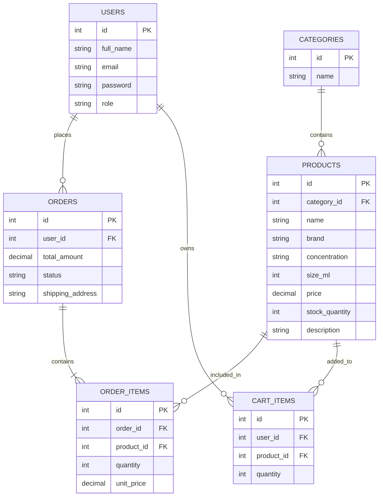

# Sprint 1: System Architecture & Scope Definition

## Project: Essence Store
**Men's Perfume E-Commerce Website**

**Technology:** PHP, HTML, CSS, MySQL

---

## 1. Target Audience & Market Focus

### Target Users
Our main users are men aged 18–40 who want to buy perfumes online. This includes students, working professionals, and people buying perfumes as gifts.

### Problem
Many perfume buyers find it difficult to compare perfumes, prices, brands, scent types, and sizes in one place. Small perfume sellers also need a simple online store to manage products and orders.

### Project Scope
The website will focus only on men's perfumes. Women's and unisex perfumes and other grooming products are not included in the MVP.

---

## 2. MVP Feature Scope

| Category | Feature | Description | Priority |
|---|---|---|---|
| Authentication | Registration & Login | Users can create an account and log in securely. | High |
| Catalog & Admin | Product Management | Users can view and search perfumes. Admin can add, edit, delete products and update stock. | High |
| Catalog & Admin | Product Details | Shows perfume name, brand, scent, concentration, size, price, and stock. | High |
| Cart | Cart Management | Users can add, update, and remove products from the cart. | High |
| Checkout | Order Placement | Users can enter their address and place an order. | High |
| Catalog & Admin | Order Management | Admin can view orders and update their status. | Medium |

---

## 3. Tech Stack

### Frontend: HTML & CSS
Used to create a simple, clean, and attractive perfume website.

### Backend: PHP
PHP will handle login, products, cart, orders, and other website functions.

### Database: MySQL
MySQL will store users, products, categories, orders, and cart information.

### Development Environment
The project can be developed using XAMPP with PHP and MySQL.

---

## 4. Entity-Relationship Diagram (ERD)

### Main Relationships

- One user can place many orders.
- One user can have many cart items.
- One order can contain many products.
- One product can appear in many orders.
- One category can contain many products.

---

## 5. Conclusion

Sprint 1 defines the basic users, features, technology, and database structure of the **Essence Store**. The project will provide a simple online shopping experience for men's perfumes while allowing the admin to manage products, stock, and orders.

**Repository Path:** `/docs/SPRINT_1.md`
