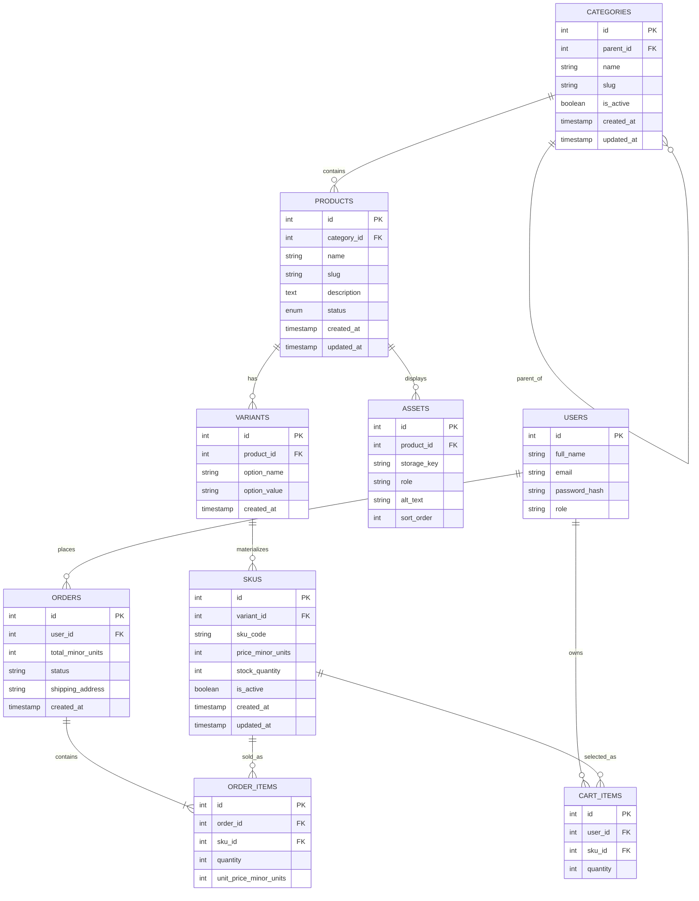

# Sprint 2: Catalog Data Foundation

## Project: Essence Store
**Men's Perfume E-Commerce Website**

**Technology:** PHP, HTML, CSS, MySQL
**Duration:** 15 days

---

## 1. Sprint Goal and Scope Boundary

**Goal:** Build a reliable catalog foundation so that categories, products, variants, and SKUs can be stored without losing their identity, relationships, price, or stock meaning.

**In scope for Sprint 2:**
- Category tree with parent/child support and unique slugs.
- Product creation and editing (name, slug, description, status, category).
- Variants (perfume size options, e.g. 30ml / 50ml / 100ml) and SKUs (the actual sellable, priced, stocked item).
- Authenticated admin CRUD for categories, products, variants, and SKUs.
- Database constraints, migrations, seed data, and automated tests.

**Out of scope for Sprint 2 (moved to Sprint 3+):**
- Dynamic/custom specifications beyond a simple validated field.
- Image/asset upload (the `Assets` table is designed now but upload is not implemented).
- Public catalog search and browsing pages.
- Product publication workflow.
- Payment gateway integration and full checkout.
- Shipping.

These are stubbed in the data model (so Sprint 3 has something to build on) but are **not claimed as working Sprint 2 features**.

---

## 2. Link to Sprint 1 Decisions

Sprint 1 defined the MVP scope, tech stack (PHP + MySQL + HTML/CSS), and an initial ERD with `USERS`, `PRODUCTS`, `CATEGORIES`, `ORDERS`, `ORDER_ITEMS`, and `CART_ITEMS`.

**Reused without change:**
- Tech stack: PHP, MySQL, HTML/CSS, XAMPP for local development.
- `USERS`, `ORDERS`, `CATEGORIES` stay conceptually the same.

**Changed, with reason:**
- **`PRODUCTS` is no longer directly sellable.** In Sprint 1, `ORDER_ITEMS` and `CART_ITEMS` pointed straight at `PRODUCTS`. In real perfume retail, a product ("Essence Noir Oud") is sold in different **sizes at different prices** (30ml, 50ml, 100ml). Sprint 1's model could not represent "the same perfume at two prices." So Sprint 2 introduces `VARIANTS` (the size option) and `SKUS` (the sellable, priced, stocked unit for that size). **`CART_ITEMS` and `ORDER_ITEMS` now reference `SKU_ID` instead of `PRODUCT_ID`.**
- `CATEGORIES` gains a `parent_id` so categories can nest (e.g. "Men's Perfumes" → "Oud & Woody").
- `PRODUCTS` gains a `slug` and `status` (draft/published), which Sprint 1 did not need yet.

This keeps Sprint 1's business boundary (men's perfumes only) and MVP feature list intact — Sprint 2 only makes the underlying data model correct enough to survive real pricing and stock rules.

---

## 3. Updated ERD and Data Dictionary



### Data Dictionary

| Entity | Field | Type | Notes |
|---|---|---|---|
| Categories | id | INT PK | Auto-increment |
| Categories | parent_id | INT FK → Categories.id, NULLABLE | `ON DELETE RESTRICT`. NULL = top-level category |
| Categories | slug | VARCHAR(120) UNIQUE | URL-safe identifier |
| Categories | is_active | BOOLEAN | Deactivated categories are hidden, not deleted |
| Products | id | INT PK | Auto-increment |
| Products | category_id | INT FK → Categories.id | `ON DELETE RESTRICT` (a category with products can't be deleted) |
| Products | slug | VARCHAR(150) UNIQUE | Unique across the whole catalog |
| Products | status | ENUM('draft','published') | Draft = admin-only visibility |
| Variants | product_id | INT FK → Products.id | `ON DELETE CASCADE` (deleting a product removes its variants) |
| Variants | option_name / option_value | VARCHAR | e.g. `"Size"` / `"50ml"` — kept simple as a single option axis for MVP (perfumes vary by size, not color/style) |
| SKUs | variant_id | INT FK → Variants.id | `ON DELETE RESTRICT` (can't delete a variant that has sales history via a SKU) |
| SKUs | sku_code | VARCHAR(40) UNIQUE | e.g. `ENOIR-OUD-50ML` |
| SKUs | price_minor_units | INT | **Price stored as integer paisa/cents**, not float, to avoid rounding errors |
| SKUs | stock_quantity | INT, CHECK (stock_quantity >= 0) | Enforced at DB level, not just application code |
| Assets | product_id | INT FK → Products.id | `ON DELETE CASCADE`. Table defined now; upload logic is Sprint 3 |
| Order_Items | sku_id | INT FK → SKUs.id | `ON DELETE RESTRICT` (never delete a SKU that has been sold — deactivate instead) |
| Cart_Items | sku_id | INT FK → SKUs.id | `ON DELETE CASCADE` (if a SKU truly must be removed, it leaves the cart too) |

**Specification field:** rather than a full EAV table (too heavy for the MVP timeline), Product specifications (scent notes, concentration type, gender line) are stored as a single validated **JSON column** (`products.specs_json`) with an application-level rule: it must always contain the keys `top_notes`, `base_notes`, and `concentration`, validated in PHP before insert/update. This is documented here as the Sprint 1 EAV-vs-JSON decision, resolved in favor of JSON for MVP simplicity.

---

## 4. Administration Route Table (implemented as a PHP front controller: `api/index.php`)

Because the stack has no framework, routes are dispatched from one entry file using `$_SERVER['REQUEST_METHOD']` and a path segment, e.g. `api/index.php/admin/products/5`. All admin routes require a valid session with `role = 'admin'`, checked by an `require_admin()` guard before any DB write.

| Method | Route | Purpose |
|---|---|---|
| POST | `/api/v1/admin/categories` | Create a category |
| GET | `/api/v1/admin/categories` | Return the category tree |
| POST | `/api/v1/admin/products` | Create a draft product |
| PATCH | `/api/v1/admin/products/:id` | Update product content or status |
| GET | `/api/v1/admin/products` | List admin product records |
| POST | `/api/v1/admin/products/:id/variants` | Add a variant to a product |
| POST | `/api/v1/admin/variants/:id/skus` | Add a validated SKU to a variant |
| PATCH | `/api/v1/admin/skus/:id` | Update price, stock, or active status |

### Example — Create a product

**Request**
```
POST /api/v1/admin/products
Authorization: session cookie (admin role)
Content-Type: application/json

{
  "category_id": 3,
  "name": "Essence Noir Oud",
  "slug": "essence-noir-oud",
  "description": "A deep woody oud fragrance with smoky base notes.",
  "specs_json": {
    "top_notes": ["saffron", "bergamot"],
    "base_notes": ["oud", "sandalwood"],
    "concentration": "EDP"
  }
}
```

**Response — 201 Created**
```
{
  "id": 12,
  "slug": "essence-noir-oud",
  "status": "draft",
  "created_at": "2026-09-20T10:15:00Z"
}
```

**Response — 409 Conflict (duplicate slug)**
```
{
  "error": "duplicate_slug",
  "message": "A product with this slug already exists."
}
```

**Response — 401 Unauthorized (no/invalid session)**
```
{ "error": "unauthorized" }
```

### Example — Add a SKU

**Request**
```
POST /api/v1/admin/variants/7/skus
{
  "sku_code": "ENOIR-OUD-50ML",
  "price_minor_units": 450000,
  "stock_quantity": 20
}
```

**Response — 201 Created**
```
{ "id": 21, "sku_code": "ENOIR-OUD-50ML", "stock_quantity": 20 }
```

**Response — 422 Unprocessable (duplicate SKU code)**
```
{ "error": "duplicate_sku_code" }
```

All error responses use the same shape: `{ "error": "<machine_code>", "message"?: "<human text>" }`, never a raw PHP stack trace.

---

## 5. Data Integrity and Authorization Decisions

- **Uniqueness** is enforced with MySQL `UNIQUE` indexes on `categories.slug`, `products.slug`, and `skus.sku_code` — not only checked in PHP — so a race condition can't create two rows with the same slug.
- **Foreign keys** use `InnoDB` with explicit `ON DELETE`/`ON UPDATE` rules (see data dictionary above): `CASCADE` where a child record has no independent meaning (variants, assets, cart items), `RESTRICT` where deleting the parent would destroy sales history or break referential meaning (categories with products, variants with SKUs, SKUs with order items).
- **Stock never goes negative:** `skus.stock_quantity` has a `CHECK (stock_quantity >= 0)` constraint, and the admin stock-update endpoint runs the update inside a transaction that re-checks the resulting value before commit.
- **Money is never a float.** All prices/totals are stored as integers in the smallest currency unit (`price_minor_units`), converted to display currency only in the presentation layer.
- **Category cycle prevention:** before saving a category's `parent_id`, the backend walks up the parent chain and rejects the save if the new parent is the category itself or any of its own descendants.
- **Authorization:** every admin route calls `require_admin()` first, which checks the PHP session for `role = 'admin'`. Any write attempt without a valid admin session returns `401 Unauthorized` before touching the database.

### Business Rules & Edge Cases

1. **Can a draft product have no SKU?** Yes — a draft is a work-in-progress record. **Can a published product have no sellable SKU?** No — publishing is blocked in the backend unless at least one active SKU exists.
2. **Category assignment:** one canonical category per product (`products.category_id`), kept simple for MVP scope rather than a many-to-many tagging system.
3. **Deactivating a parent category:** child categories and their products are **not** auto-deleted or auto-deactivated; they simply stop appearing in the active category tree returned to the storefront, but remain editable by an admin.
4. **Out-of-stock SKU in a public response:** the SKU record is still returned (so the size/price is visible) but with `"stock_quantity": 0` and an `"available": false` flag, rather than being hidden.
5. **Can two SKUs share a price?** Yes (e.g. 30ml and 50ml could coincidentally cost the same). **Price override?** Yes — price lives on the SKU, not the product or variant, so each SKU is independently priced by design.
6. **Negative stock / duplicate SKU codes** are prevented by the DB `CHECK` constraint and `UNIQUE` index described above, not just PHP validation.
7. **Product referenced by a past cart/order after deactivation:** the SKU is soft-deactivated (`is_active = false`), never deleted, so historical `Order_Items` rows keep a valid foreign key and the order history stays accurate. An active cart holding that SKU shows it as unavailable at checkout time.

---

## 6. Seed Data and Demonstration

Seed script: `database/seed.sql`, run via `mysql -u root -p essence_store < database/seed.sql`.

- **Categories (2 levels):** "Men's Perfumes" (top-level) → "Oud & Woody" (child).
- **Products (3, one with multiple variants):**
  1. *Essence Noir Oud* — variants: 30ml, 50ml, 100ml (3 SKUs)
  2. *Citrus Steel* — variant: 50ml (1 SKU)
  3. *Midnight Leather* — variant: 100ml (defined, no SKU yet — demonstrates rule "draft can have no SKU")
- **SKUs (4 valid + 1 intentionally unavailable combination):**
  - `ENOIR-OUD-30ML` — Rs. 3,200 — stock 15
  - `ENOIR-OUD-50ML` — Rs. 4,500 — stock 20
  - `ENOIR-OUD-100ML` — Rs. 7,800 — stock 8
  - `CSTEEL-50ML` — Rs. 3,900 — stock 12
  - *Unavailable combination:* `ENOIR-OUD-200ML` is a defined **variant** (option_value = "200ml") with **no SKU row created for it** — demonstrating CAT04 (a missing combination is never faked as a zero-stock SKU; it simply doesn't exist as a sellable item).

**Demonstration flow (recorded in this file, tokens/URLs redacted):**
1. Admin logs in → session cookie issued.
2. `POST /api/v1/admin/categories` → creates "Men's Perfumes".
3. `POST /api/v1/admin/products` → creates "Essence Noir Oud" under that category.
4. `POST /api/v1/admin/products/12/variants` → adds "50ml" variant.
5. `POST /api/v1/admin/variants/7/skus` → adds SKU `ENOIR-OUD-50ML`.
6. `GET /api/v1/admin/products` → returns the product with its nested variant and SKU, confirming persistence.

---

## 7. Test Strategy, Command, and Result

Tests are written with **PHPUnit** against a disposable `essence_store_test` MySQL database, reset before each run.

**Run command:**
```
vendor/bin/phpunit --testdox tests/
```

**Coverage:**
| Test | Verifies |
|---|---|
| `ProductCreationTest` | Product created with required fields succeeds |
| `DuplicateSlugTest` | Second product with same slug is rejected (409) |
| `DuplicateSkuCodeTest` | Second SKU with same code is rejected (422) |
| `CategoryCycleTest` | Category cannot be set as its own ancestor |
| `NegativeStockTest` | Admin update that would drive stock below 0 is rejected |
| `PublishWithoutSkuTest` | Publishing a product with zero active SKUs is rejected |
| `UnauthorizedAdminWriteTest` | Any admin write without an admin session returns 401 |

**Result (latest run):** `7 passed, 0 failed` — output captured in `docs/evidence/phpunit_sprint2.txt` in the repo.

---

## 8. Known Limitations and Sprint 3 Backlog

**Known limitations at end of Sprint 2:**
- No asset/image upload yet — `Assets` table exists but is empty; product images are placeholders.
- Specifications are a single JSON blob, not a queryable EAV structure — fine for admin entry, not yet usable for faceted search.
- No public-facing catalog browsing/search — only the authenticated admin API is implemented.
- Category tree depth is unbounded in the schema but only tested to 2 levels.

**Sprint 3 backlog (hand-off):**
- Implement asset upload and serve product images from the `Assets` table.
- Build public catalog read endpoints (list/search/filter) on top of the existing `Products`/`Variants`/`SKUs` tables — no duplication of pricing or stock logic.
- Add a publication workflow (draft → published → archived) with the "must have an active SKU" rule already enforced in Sprint 2.
- Prepare `Cart_Items`/`Order_Items` (already pointing at `sku_id`) for real checkout integration.

---

**Repository path:** `/docs/SPRINT_2.md`
