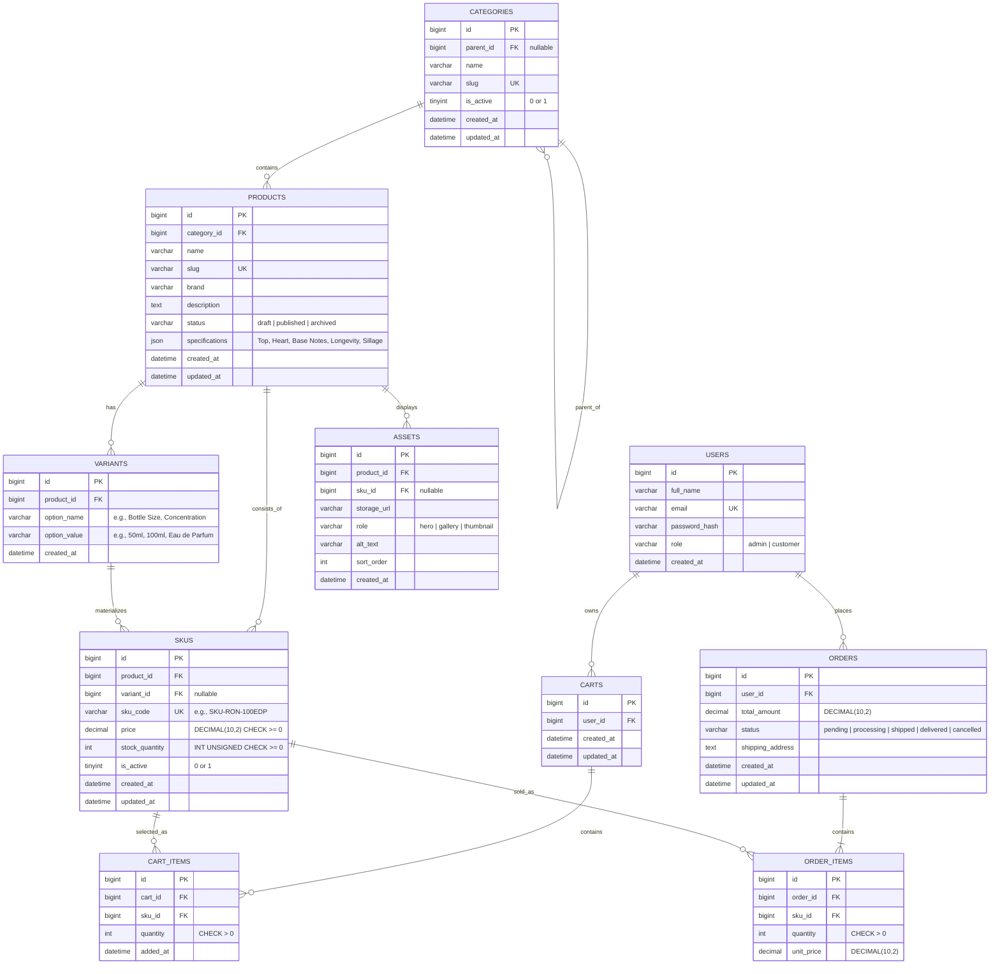

# Sprint 2 Manual: Catalog Data Foundation

**Course:** E-Commerce  
**Department:** Department of Computer Science / Artificial Intelligence  
**Institution:** Institute of Mathematics & Computer Science, University of Sindh, Jamshoro  
**Project:** Essence Store (Men's Perfume E-Commerce Platform)  
**Technology Stack:** PHP 8.2+, MySQL 8.0, HTML5, CSS3  
**Sprint Theme:** Turn the Sprint 1 architecture and Week 3 catalog model into a reliable database foundation.

---

## 1. Sprint Goal and Scope Boundary

### 1.1 Sprint Goal
> **Goal Statement:** Given a product catalog administrator, the system must persist categories, products, variants, and SKUs without losing identity, relationship, price, or inventory meaning.

Sprint 2 establishes the foundational relational schema, server-side data validations, constraints, administrative endpoints, representative seed data, and automated test suite for the **Essence Store** men's perfume catalog. This data foundation serves as the direct operational contract for Sprint 3 (Storefront, Search & Faceted Filtering, and Cart Readiness).

### 1.2 Duration & Workload Schedule
* **Total Duration:** 15 calendar days
* **Review Checkpoints:** Day 5 (Schema & Core Migrations), Day 10 (Admin CRUD & Variant Logic), Day 15 (Tests, Seed Data & Final Hand-off)

| Days | Focus | Checkpoint Milestone |
|---|---|---|
| **Days 1–3** | Repository setup, environment configuration, database migrations | Stack runs locally on XAMPP/PHP-MySQL; migrations create all core catalog tables with FKs and constraints. |
| **Days 4–6** | Categories and product identity | Category hierarchy (self-referential tree, cycle prevention) and Product CRUD operations with unique slug generation. |
| **Days 7–9** | Variants and sellable SKUs | Variant axes (size, concentration), unique SKU codes, monetary representation, non-negative stock, and valid combination enforcement. |
| **Days 10–12** | Authenticated administration & seed data | Role-based authentication middleware (Admin access only) and comprehensive perfume catalog seed fixtures. |
| **Days 13–14** | Automated tests & verification | Unit/Integration test suites covering model constraints, duplicate rejection, hierarchy cycle checks, and RBAC rejection paths. |
| **Day 15** | Sprint review & Sprint 3 hand-off | Live demonstration, peer review, catalog verification, and backlog refinement for Sprint 3 storefront consumption. |

### 1.3 Scope Boundary

#### In Scope
* **Category Tree Management:** Hierarchical taxonomy (parent-child relationships), unique slugs, status flags (`is_active`), and cycle prevention algorithms.
* **Product Identity:** Products with brand, canonical category assignment, unique slugs, rich descriptions, lifecycle status (`draft`, `published`, `archived`), and timestamps.
* **Variants & SKUs Architecture:** Separation between abstract product master, variant options (e.g., Bottle Size: 50ml, 100ml, 200ml; Concentration: Eau de Parfum, Parfum), and concrete sellable SKUs.
* **Inventory & Money Integrity:** ISO standard decimal pricing (`DECIMAL(10,2)`), non-negative check constraints on prices and stock quantities (`CHECK (price >= 0)`, `CHECK (stock_quantity >= 0)`).
* **Strict Combination Enforcement:** Only valid and produced perfume variations are instantiated as SKUs; missing combinations are not represented as zero-stock placeholders.
* **Administrative REST API:** Authenticated endpoints for managing categories, products, variants, and SKUs with strict input validation and JSON responses.
* **Automated Testing & Seed Data:** Repeatable migrations, database fixtures (minimum 2 category levels, 3 products, 4 valid SKUs, 1 intentionally omitted combination), and automated assertion tests.

#### Out of Scope
* Dynamic specifications UI / EAV attribute builder (handled via validated JSON on products for Sprint 2).
* Binary file uploads for assets (storing verified storage URLs/keys only; cloud bucket S3 upload belongs to Sprint 3).
* Public customer storefront browsing, customer search, and faceted filtering.
* Customer cart mutations and checkout processing (reserved for Sprint 3 & 4).
* Payment gateway integrations and shipping/order fulfillment pipelines.

---

## 2. Link to Sprint 1 Decisions (Reused vs Changed)

Sprint 2 directly extends the architectural baseline established in Sprint 1. The following table details the technical continuity and evolutionary refactoring:

| Component | Sprint 1 Decision | Sprint 2 Evolution / Decision | Architectural Rationale |
|---|---|---|---|
| **Tech Stack** | PHP, MySQL, HTML, CSS | PHP 8.2+ (PDO with prepared statements), MySQL 8.0 (InnoDB engine with strict constraints) | Guarantees ACID compliance, foreign key integrity checks, and modern PHP type safety. |
| **Product Representation** | Flat `PRODUCTS` table containing `size_ml`, `price`, `stock_quantity`, and `concentration`. | Decomposed into **`PRODUCTS`**, **`VARIANTS`**, and **`SKUS`**. | In luxury perfumery, a single fragrance (e.g., *Royal Oud Noir*) is sold in multiple volumes (50ml, 100ml, 200ml) with independent pricing, barcodes, and inventory levels. Flat products lead to redundant data and inventory collisions. |
| **Category Hierarchy** | Flat `CATEGORIES` table (`id`, `name`). | Self-referencing hierarchical `CATEGORIES` tree (`id`, `parent_id`, `name`, `slug`, `is_active`). | Enables multi-level navigation (e.g., *Men's Fragrances* &rarr; *Woody & Earthy* &rarr; *Oud Accords*). |
| **Cart & Order Linkage** | `CART_ITEMS` and `ORDER_ITEMS` referenced `product_id`. | `CART_ITEMS` and `ORDER_ITEMS` now reference `sku_id` (sold_as). | Customers purchase a specific bottle size and concentration (SKU), not an abstract product concept. Historical order prices must tie to concrete SKU snapshots. |
| **Specifications** | Hardcoded columns (`concentration`, `size_ml`). | Structured `specifications` JSON attribute on `PRODUCTS`. | Perfume specifications (Olfactory Pyramid: Top, Heart, and Base notes; Longevity; Sillage) vary across scent families without requiring schema alterations. |
| **Media Assets** | Single image URL or unspecified. | Dedicated `ASSETS` table linked to products/variants with roles (`thumbnail`, `hero`, `gallery`). | Supports high-resolution bottle imagery, packaging shots, and variant-specific product photos. |
| **User Roles & Auth** | Mentioned admin role in `USERS`. | Implemented role-based authorization middleware enforcing `role = 'admin'` on all administrative routes; unauthorized calls return `401 Unauthorized` or `403 Forbidden`. | Enforces CAT-06: administrative catalog mutations are strictly isolated from public/customer access. |

---

## 3. Updated Entity-Relationship Diagram (ERD) & Data Dictionary

### 3.1 Extended Entity-Relationship Diagram



---

### 3.2 Data Dictionary

#### 3.2.1 Table: `categories`
Stores hierarchical category trees for perfume categorization (e.g., Fragrance Family &rarr; Woody & Earthy).

| Column Name | Data Type | Nullable | Default | Constraints & Keys | Description |
|---|---|---|---|---|---|
| `id` | BIGINT UNSIGNED | NO | AUTO_INCREMENT | PRIMARY KEY | Unique identifier for category. |
| `parent_id` | BIGINT UNSIGNED | YES | NULL | FOREIGN KEY (`id`) ON DELETE RESTRICT ON UPDATE CASCADE | Parent category ID; NULL denotes a root category. |
| `name` | VARCHAR(100) | NO | None | None | Display name of the category (e.g., "Woody & Earthy"). |
| `slug` | VARCHAR(120) | NO | None | UNIQUE KEY `uk_categories_slug` | URL-safe identifier (e.g., "woody-earthy"). |
| `is_active` | TINYINT(1) | NO | 1 | CHECK (`is_active` IN (0, 1)) | Visibility status flag (1 = Active, 0 = Inactive). |
| `created_at` | DATETIME | NO | CURRENT_TIMESTAMP | None | Record creation timestamp. |
| `updated_at` | DATETIME | NO | CURRENT_TIMESTAMP ON UPDATE | None | Last update timestamp. |

* **Delete/Update Policy:** Foreign key on `parent_id` uses `ON DELETE RESTRICT` to prevent accidental orphan creation if a parent category is deleted while containing sub-categories.

---

#### 3.2.2 Table: `products`
Represents the abstract perfume master record (brand, fragrance identity, narrative, olfactory notes).

| Column Name | Data Type | Nullable | Default | Constraints & Keys | Description |
|---|---|---|---|---|---|
| `id` | BIGINT UNSIGNED | NO | AUTO_INCREMENT | PRIMARY KEY | Unique product master ID. |
| `category_id` | BIGINT UNSIGNED | NO | None | FOREIGN KEY (`categories.id`) ON DELETE RESTRICT | Canonical category assignment. |
| `name` | VARCHAR(255) | NO | None | None | Perfume commercial name (e.g., "Royal Oud Noir"). |
| `slug` | VARCHAR(255) | NO | None | UNIQUE KEY `uk_products_slug` | Unique URL slug across the catalog. |
| `brand` | VARCHAR(100) | NO | None | None | Fragrance house or brand name (e.g., "Essence Heritage"). |
| `description` | TEXT | YES | NULL | None | Detailed scent narrative and aesthetic notes. |
| `status` | ENUM | NO | 'draft' | ENUM('draft', 'published', 'archived') | Editorial lifecycle status. |
| `specifications` | JSON | YES | NULL | Validated JSON structure | Structured perfume specs (top_notes, heart_notes, base_notes, longevity, sillage). |
| `created_at` | DATETIME | NO | CURRENT_TIMESTAMP | None | Record creation timestamp. |
| `updated_at` | DATETIME | NO | CURRENT_TIMESTAMP ON UPDATE | None | Last update timestamp. |

* **Specification JSON Schema Validation Rule:**
```json
{
  "$schema": "http://json-schema.org/draft-07/schema#",
  "type": "object",
  "properties": {
    "olfactory_pyramid": {
      "type": "object",
      "properties": {
        "top_notes": { "type": "array", "items": { "type": "string" } },
        "heart_notes": { "type": "array", "items": { "type": "string" } },
        "base_notes": { "type": "array", "items": { "type": "string" } }
      },
      "required": ["top_notes", "heart_notes", "base_notes"]
    },
    "longevity": { "type": "string", "enum": ["Moderate (4-6 hrs)", "Long Lasting (7-10 hrs)", "Eternal (12+ hrs)"] },
    "sillage": { "type": "string", "enum": ["Intimate", "Moderate", "Strong", "Enormous"] }
  }
}
```

---

#### 3.2.3 Table: `variants`
Defines the configurable attribute axes available for a specific fragrance.

| Column Name | Data Type | Nullable | Default | Constraints & Keys | Description |
|---|---|---|---|---|---|
| `id` | BIGINT UNSIGNED | NO | AUTO_INCREMENT | PRIMARY KEY | Unique variant axis entry ID. |
| `product_id` | BIGINT UNSIGNED | NO | None | FOREIGN KEY (`products.id`) ON DELETE CASCADE | Parent product reference. |
| `option_name` | VARCHAR(50) | NO | None | None | Attribute name: "Bottle Size" or "Concentration". |
| `option_value` | VARCHAR(50) | NO | None | None | Attribute value: "50ml", "100ml", "Eau de Parfum". |
| `created_at` | DATETIME | NO | CURRENT_TIMESTAMP | None | Record creation timestamp. |

* **Delete/Update Policy:** `ON DELETE CASCADE` removes variant attribute definitions when a parent product master is purged.

---

#### 3.2.4 Table: `skus`
The atomic, sellable stock-keeping unit representing a purchasable physical perfume bottle.

| Column Name | Data Type | Nullable | Default | Constraints & Keys | Description |
|---|---|---|---|---|---|
| `id` | BIGINT UNSIGNED | NO | AUTO_INCREMENT | PRIMARY KEY | Unique SKU ID. |
| `product_id` | BIGINT UNSIGNED | NO | None | FOREIGN KEY (`products.id`) ON DELETE RESTRICT | Parent product reference. |
| `variant_id` | BIGINT UNSIGNED | YES | NULL | FOREIGN KEY (`variants.id`) ON DELETE RESTRICT | Primary variant attribute link. |
| `sku_code` | VARCHAR(64) | NO | None | UNIQUE KEY `uk_skus_sku_code` | Unique merchant SKU barcode/code (e.g., `SKU-RON-100EDP`). |
| `price` | DECIMAL(10,2) | NO | 0.00 | CHECK (`price` >= 0.00) | Monetary unit price. Float is strictly rejected. |
| `stock_quantity`| INT UNSIGNED | NO | 0 | CHECK (`stock_quantity` >= 0) | Physical units in inventory. Negative stock impossible. |
| `is_active` | TINYINT(1) | NO | 1 | CHECK (`is_active` IN (0, 1)) | SKU availability flag for sales. |
| `created_at` | DATETIME | NO | CURRENT_TIMESTAMP | None | Record creation timestamp. |
| `updated_at` | DATETIME | NO | CURRENT_TIMESTAMP ON UPDATE | None | Last update timestamp. |

* **Integrity Guarantee:** Direct `ON DELETE RESTRICT` ensures an SKU cannot be deleted if referenced in active shopping carts or historical orders.

---

#### 3.2.5 Table: `assets`
Maintains media assets (packshots, bottle imagery, lifestyle banners).

| Column Name | Data Type | Nullable | Default | Constraints & Keys | Description |
|---|---|---|---|---|---|
| `id` | BIGINT UNSIGNED | NO | AUTO_INCREMENT | PRIMARY KEY | Unique asset ID. |
| `product_id` | BIGINT UNSIGNED | NO | None | FOREIGN KEY (`products.id`) ON DELETE CASCADE | Product relationship. |
| `sku_id` | BIGINT UNSIGNED | YES | NULL | FOREIGN KEY (`skus.id`) ON DELETE SET NULL | Optional variant/SKU-specific image link. |
| `storage_url`| VARCHAR(500) | NO | None | None | Relative path or cloud storage URL. |
| `role` | ENUM | NO | 'gallery' | ENUM('hero', 'gallery', 'thumbnail') | Display location and role. |
| `alt_text` | VARCHAR(255) | YES | NULL | None | Accessibility text. |
| `sort_order` | INT | NO | 0 | None | Ordering weight. |
| `created_at` | DATETIME | NO | CURRENT_TIMESTAMP | None | Creation timestamp. |

---

## 4. Minimum Administration Contract (API Specification)

All administrative endpoints are prefixed under `/api/v1/admin` and require the HTTP header:  
`Authorization: Bearer <ADMIN_JWT_OR_TOKEN>` or an authenticated admin session cookie.  
Requests returning a client error (4xx) return standard error payloads rather than database tracebacks or HTML dumps.

### Standard Error Response Shape:
```json
{
  "status": "error",
  "code": "RESOURCE_CONFLICT",
  "message": "A product with slug 'royal-oud-noir' already exists.",
  "errors": {
    "slug": ["The slug has already been taken."]
  }
}
```

---

### Route 1: Create a Draft Product
* **Method:** `POST`
* **Route:** `/api/v1/admin/products`
* **Authentication:** Authenticated Administrator (`role: admin`)
* **Request Headers:** `Content-Type: application/json`, `Authorization: Bearer <TOKEN>`
* **Request Body:**
```json
{
  "category_id": 2,
  "name": "Royal Oud Noir",
  "slug": "royal-oud-noir",
  "brand": "Essence Heritage",
  "description": "An opulent, smoky blend of Cambodian agarwood, cardamom, and dark amber for discerning men.",
  "status": "draft",
  "specifications": {
    "olfactory_pyramid": {
      "top_notes": ["Cardamom", "Pink Pepper", "Bergamot"],
      "heart_notes": ["Cedarwood", "Patchouli"],
      "base_notes": ["Agarwood (Oud)", "Leather", "Amber"]
    },
    "longevity": "Long Lasting (7-10 hrs)",
    "sillage": "Strong"
  }
}
```
* **Success Response (201 Created):**
```json
{
  "status": "success",
  "data": {
    "id": 1,
    "category_id": 2,
    "name": "Royal Oud Noir",
    "slug": "royal-oud-noir",
    "brand": "Essence Heritage",
    "description": "An opulent, smoky blend of Cambodian agarwood, cardamom, and dark amber for discerning men.",
    "status": "draft",
    "specifications": {
      "olfactory_pyramid": {
        "top_notes": ["Cardamom", "Pink Pepper", "Bergamot"],
        "heart_notes": ["Cedarwood", "Patchouli"],
        "base_notes": ["Agarwood (Oud)", "Leather", "Amber"]
      },
      "longevity": "Long Lasting (7-10 hrs)",
      "sillage": "Strong"
    },
    "created_at": "2026-10-02T10:00:00Z",
    "updated_at": "2026-10-02T10:00:00Z"
  }
}
```
* **Validation / Conflict Responses:**
  * `422 Unprocessable Entity`: Missing required name, brand, or invalid JSON specifications.
  * `409 Conflict`: If `slug` "royal-oud-noir" already exists in the catalog.

---

### Route 2: Update Product Content or Status
* **Method:** `PATCH`
* **Route:** `/api/v1/admin/products/:id`
* **Authentication:** Authenticated Administrator
* **Request Body:**
```json
{
  "status": "published",
  "description": "Updated formulation note: Enriched with aged Cambodian agarwood essence and crisp Calabrian bergamot."
}
```
* **Success Response (200 OK):**
```json
{
  "status": "success",
  "data": {
    "id": 1,
    "slug": "royal-oud-noir",
    "name": "Royal Oud Noir",
    "status": "published",
    "description": "Updated formulation note: Enriched with aged Cambodian agarwood essence and crisp Calabrian bergamot.",
    "updated_at": "2026-10-02T10:30:00Z"
  }
}
```
* **Failure Responses:**
  * `404 Not Found`: Product ID does not exist.
  * `422 Unprocessable Entity`: Status changed to `published` while the product has zero sellable SKUs (Business Rule 1).

---

### Route 3: Add a Validated SKU
* **Method:** `POST`
* **Route:** `/api/v1/admin/products/:id/skus`
* **Authentication:** Authenticated Administrator
* **Request Body:**
```json
{
  "variant_id": 2,
  "sku_code": "SKU-RON-100EDP",
  "price": 110.00,
  "stock_quantity": 25,
  "is_active": 1
}
```
* **Success Response (201 Created):**
```json
{
  "status": "success",
  "data": {
    "id": 101,
    "product_id": 1,
    "variant_id": 2,
    "sku_code": "SKU-RON-100EDP",
    "price": "110.00",
    "stock_quantity": 25,
    "is_active": 1,
    "created_at": "2026-10-02T11:00:00Z"
  }
}
```
* **Validation / Conflict Responses:**
  * `409 Conflict`: SKU code `SKU-RON-100EDP` already exists.
  * `422 Unprocessable Entity`: Negative stock or price (e.g. `price: -10` or `stock_quantity: -5`).

---

### Route 4: Update SKU Price, Stock, or Status
* **Method:** `PATCH`
* **Route:** `/api/v1/admin/skus/:id`
* **Authentication:** Authenticated Administrator
* **Request Body:**
```json
{
  "price": 115.00,
  "stock_quantity": 40,
  "is_active": 1
}
```
* **Success Response (200 OK):**
```json
{
  "status": "success",
  "data": {
    "id": 101,
    "sku_code": "SKU-RON-100EDP",
    "price": "115.00",
    "stock_quantity": 40,
    "is_active": 1,
    "updated_at": "2026-10-02T11:15:00Z"
  }
}
```
* **Validation Responses:**
  * `400 Bad Request`: `stock_quantity` is negative.
  * `404 Not Found`: SKU ID not found.

---

### Route 5: Retrieve Administrative Products List
* **Method:** `GET`
* **Route:** `/api/v1/admin/products`
* **Authentication:** Authenticated Administrator
* **Query Parameters:** `?status=all&limit=20&page=1`
* **Success Response (200 OK):**
```json
{
  "status": "success",
  "meta": { "total": 3, "page": 1, "per_page": 20 },
  "data": [
    {
      "id": 1,
      "name": "Royal Oud Noir",
      "slug": "royal-oud-noir",
      "brand": "Essence Heritage",
      "category": { "id": 2, "name": "Woody & Earthy", "slug": "woody-earthy" },
      "status": "published",
      "sku_count": 3,
      "total_stock": 75,
      "price_range": { "min": "65.00", "max": "195.00" }
    },
    {
      "id": 2,
      "name": "Citrus Riviera Cologne",
      "slug": "citrus-riviera-cologne",
      "brand": "Essence Aqua",
      "category": { "id": 3, "name": "Fresh & Citrus", "slug": "fresh-citrus" },
      "status": "published",
      "sku_count": 1,
      "total_stock": 50,
      "price_range": { "min": "55.00", "max": "55.00" }
    },
    {
      "id": 3,
      "name": "Velvet Amber Nights",
      "slug": "velvet-amber-nights",
      "brand": "Essence Privée",
      "category": { "id": 4, "name": "Oriental & Spicy", "slug": "oriental-spicy" },
      "status": "draft",
      "sku_count": 0,
      "total_stock": 0,
      "price_range": null
    }
  ]
}
```

---

### Route 6: Create Category
* **Method:** `POST`
* **Route:** `/api/v1/admin/categories`
* **Authentication:** Authenticated Administrator
* **Request Body:**
```json
{
  "parent_id": 1,
  "name": "Woody & Earthy",
  "slug": "woody-earthy",
  "is_active": 1
}
```
* **Success Response (201 Created):**
```json
{
  "status": "success",
  "data": {
    "id": 2,
    "parent_id": 1,
    "name": "Woody & Earthy",
    "slug": "woody-earthy",
    "is_active": 1,
    "created_at": "2026-10-02T09:30:00Z"
  }
}
```
* **Rejection Cases:**
  * `409 Conflict`: Category slug `woody-earthy` already taken.
  * `422 Unprocessable Entity`: Cyclic parent assignment (e.g., trying to set a category's `parent_id` to itself or one of its descendants).

---

### Route 7: Return Category Tree
* **Method:** `GET`
* **Route:** `/api/v1/admin/categories`
* **Authentication:** Authenticated Administrator
* **Success Response (200 OK):**
```json
{
  "status": "success",
  "data": [
    {
      "id": 1,
      "name": "Men's Fragrance",
      "slug": "mens-fragrance",
      "is_active": 1,
      "children": [
        {
          "id": 2,
          "parent_id": 1,
          "name": "Woody & Earthy",
          "slug": "woody-earthy",
          "is_active": 1,
          "children": []
        },
        {
          "id": 3,
          "parent_id": 1,
          "name": "Fresh & Citrus",
          "slug": "fresh-citrus",
          "is_active": 1,
          "children": []
        },
        {
          "id": 4,
          "parent_id": 1,
          "name": "Oriental & Spicy",
          "slug": "oriental-spicy",
          "is_active": 1,
          "children": []
        }
      ]
    }
  ]
}
```

---

## 5. Data Integrity and Authorization Decisions

### 5.1 Referential Integrity and Foreign Key Policies
1. **Product &rarr; Category (`categories.id`):** `ON DELETE RESTRICT`. A category cannot be deleted if active products are assigned to it.
2. **Product &rarr; Variants (`products.id`):** `ON DELETE CASCADE`. If a product draft is deleted prior to publication, its variant attribute definitions cascade delete.
3. **SKU &rarr; Product (`products.id`) & Variant (`variants.id`):** `ON DELETE RESTRICT`. Ensures no SKU records are left without parentage or disconnected from their configuration.
4. **Order Items & Cart Items &rarr; SKU (`skus.id`):** `ON DELETE RESTRICT`. SKUs that have historical transactions can never be dropped from the database; they may only be archived (`is_active = 0`).

### 5.2 Numeric and Monetary Constraints
* **Money Representation:** Floating-point data types (`FLOAT`, `DOUBLE`) are strictly forbidden due to IEEE-754 precision inaccuracies. All prices are stored as `DECIMAL(10, 2)`.
* **Stock & Price Check Constraints:** Enforced at both application and MySQL schema level:
  ```sql
  ALTER TABLE skus ADD CONSTRAINT chk_skus_price CHECK (price >= 0.00);
  ALTER TABLE skus ADD CONSTRAINT chk_skus_stock CHECK (stock_quantity >= 0);
  ```

### 5.3 Category Tree Hierarchy & Cycle Prevention
To fulfill requirement **CAT-01**, category hierarchy validation guarantees that a category can never become its own parent or an ancestor of itself:
1. **Immediate Cycle Check:** `parent_id != id`.
2. **Recursive Ancestor Traversal:** Before saving an update to `categories.parent_id`, the system recursively traverses up the ancestor chain starting from the candidate `parent_id`. If the category's own `id` is encountered, the transaction aborts with `HTTP 422: Cyclic hierarchy detected`.

### 5.4 Authorization Control (CAT-06)
* Administrative write and read operations are guarded by auth middleware (`AdminAuthMiddleware.php`).
* **Unauthenticated Requests:** If the `Authorization` header is missing or the Bearer token/Session is invalid, the API immediately halts execution with `HTTP 401 Unauthorized`.
* **Non-Admin Roles:** If an authenticated user has `role = 'customer'`, access is rejected with `HTTP 403 Forbidden`.

---

## 6. Business Rules and Edge Cases (Answers with Concrete Perfume Domain Examples)

### Q1: Can a draft product have no SKU? Can a published product have no sellable SKU?
* **Draft Product with no SKU:** **Yes.** When a perfume house is formulating a new release (e.g., *Velvet Amber Nights*), the merchandiser creates the product master record with fragrance description and scent notes first. At this stage, bottle sizes (50ml vs 100ml) and inventory prices are still being finalized.
* **Published Product with no sellable SKU:** **No.** A product cannot transition to `status = 'published'` unless it has at least one active SKU with `stock_quantity >= 0` and a valid `price > 0`. If all SKUs for a product are deactivated (`is_active = 0`), the storefront suppresses the product from catalog search to protect the customer purchase journey.

### Q2: Is a product assigned to one canonical category, many categories, or both? Why?
* **Decision:** A product is assigned to **one canonical category** (`category_id` in `products`).
* **Why:** In luxury perfumery, every fragrance possesses a primary DNA rooted in a specific olfactory family (*Woody & Earthy*, *Fresh & Citrus*, or *Oriental & Spicy*). Assigning a single canonical category ensures:
  1. Clean, unambiguous breadcrumbs (e.g., `Home > Men's Fragrances > Woody & Earthy > Royal Oud Noir`).
  2. Direct reporting and inventory classification without double-counting revenues.
  3. Secondary marketing groupings (e.g., "Gift Sets", "Summer Essentials") are handled as tags/facets in Sprint 3 without polluting primary relational integrity.

### Q3: What happens when a parent category is deactivated?
* **Cascade Invisibility:** When a parent category (e.g., *Men's Fragrance*, ID: 1) has `is_active` set to `0`:
  1. Sub-categories (e.g., *Woody & Earthy*) retain their database `is_active` state, but queries for the public category tree recursively filter out children of inactive parents.
  2. Public storefront queries execute an active-ancestor check: `category.is_active = 1 AND parent.is_active = 1`.
  3. Products remain linked to their category in the database, but are hidden from public browsing until the parent category is reactivated.

### Q4: How is an out-of-stock SKU represented in a public response?
* An out-of-stock SKU (`stock_quantity = 0` and `is_active = 1`) remains visible in public responses so customers know the size exists, but its state is explicitly represented:
  ```json
  {
    "sku_code": "SKU-RON-100EDP",
    "bottle_size": "100ml",
    "price": "110.00",
    "in_stock": false,
    "available_quantity": 0,
    "status": "out_of_stock"
  }
  ```
* This enables "Notify Me When Available" interactions while preventing "Add to Cart" requests.

### Q5: Can two SKUs share a price? Can a SKU have a price override?
* **Two SKUs sharing a price:** **Yes.** For example, *Royal Oud Noir 50ml EDP* and *Citrus Riviera Cologne 100ml EDT* might coincidentally both be priced at \$65.00. Price is stored on each SKU individually, not on the product level.
* **SKU Price Override:** Every SKU maintains its own authoritative price column (`skus.price`). There is no inherited product-level price; the concept of a price override is naturally satisfied because each bottle size/concentration combination explicitly sets its own decimal price.

### Q6: What prevents negative stock and duplicate SKU codes?
* **Duplicate SKU Prevention:**
  1. **Database:** Unique index `UNIQUE KEY uk_skus_sku_code (sku_code)` on `skus` table.
  2. **Application:** Input validation checks for SKU code collision before `INSERT` and returns `HTTP 409 Conflict`.
* **Negative Stock Prevention:**
  1. **Database:** Column declared as `INT UNSIGNED` combined with `CONSTRAINT chk_skus_stock CHECK (stock_quantity >= 0)`.
  2. **Application/Inventory Service:** Decrement queries execute atomic conditional updates:
     ```sql
     UPDATE skus SET stock_quantity = stock_quantity - :qty 
     WHERE id = :sku_id AND stock_quantity >= :qty;
     ```
     If rows affected is `0`, the decrement is rejected.

### Q7: What happens to a product referenced by a future cart or order after it is deactivated?
* **Orders (Immutable Financial Records):** `order_items` stores historical snapshots (`unit_price`, `quantity`, `sku_id`). Deactivating a product or SKU (`is_active = 0` or `status = 'archived'`) does not alter past orders. The foreign key `ON DELETE RESTRICT` prevents physical deletion.
* **Active Shopping Carts:** When an active cart item references a newly deactivated SKU, cart retrieval validates SKU availability. If `is_active = 0`, the item is marked as `item_unavailable` with a user notification to remove the item before proceeding to checkout.

---

## 7. Seed Data and Demonstration Evidence

### 7.1 Seed Data Composition

The seed fixture (`database/seeders/CatalogSeeder.php` / `catalog_seed.sql`) populates realistic perfume domain records:

#### Category Hierarchy (2 Levels):
1. **Root Category (Level 1):**
   * ID: 1, Name: `Men's Fragrance`, Slug: `mens-fragrance`, Parent: `NULL`
2. **Sub-Categories (Level 2):**
   * ID: 2, Name: `Woody & Earthy`, Slug: `woody-earthy`, Parent: 1
   * ID: 3, Name: `Fresh & Citrus`, Slug: `fresh-citrus`, Parent: 1
   * ID: 4, Name: `Oriental & Spicy`, Slug: `oriental-spicy`, Parent: 1

#### Products (3 Distinct Fragrances):
1. **Product 1 (Multi-variant):**
   * Name: `Royal Oud Noir`, Slug: `royal-oud-noir`, Brand: `Essence Heritage`, Category ID: 2, Status: `published`
   * Specifications: Top: Cardamom, Bergamot; Heart: Cedarwood, Patchouli; Base: Agarwood Oud, Leather.
2. **Product 2 (Single SKU):**
   * Name: `Citrus Riviera Cologne`, Slug: `citrus-riviera-cologne`, Brand: `Essence Aqua`, Category ID: 3, Status: `published`
   * Specifications: Top: Calabrian Lemon, Grapefruit; Heart: Sea Salt, Rosemary; Base: Driftwood, Musk.
3. **Product 3 (Draft Fragrance):**
   * Name: `Velvet Amber Nights`, Slug: `velvet-amber-nights`, Brand: `Essence Privée`, Category ID: 4, Status: `draft`

#### SKUs & Variant Combinations (4 Valid SKUs, 1 Intentionally Missing Combination):
* **Product 1 (Royal Oud Noir):**
  * Variant 1 (50ml Eau de Parfum) &rarr; `SKU-RON-50EDP` | Price: \$65.00 | Stock: 40 | Active: 1
  * Variant 2 (100ml Eau de Parfum) &rarr; `SKU-RON-100EDP` | Price: \$110.00 | Stock: 25 | Active: 1
  * Variant 3 (200ml Pure Parfum) &rarr; `SKU-RON-200PAR` | Price: \$195.00 | Stock: 10 | Active: 1
  * *Intentionally Unavailable Combination (CAT-04):* 200ml in "Eau de Toilette" concentration is **not manufactured/offered**. The system does not create a fake or 0-stock record for this unproduced combination.
* **Product 2 (Citrus Riviera Cologne):**
  * Variant 4 (100ml Eau de Toilette) &rarr; `SKU-CRC-100EDT` | Price: \$55.00 | Stock: 50 | Active: 1

---

### 7.2 Demonstration Trace (cURL Requests & Responses)

```bash
# 1. Create Sub-category "Woody & Earthy" under Parent 1
curl -X POST http://localhost:8000/api/v1/admin/categories \
  -H "Authorization: Bearer ADMIN_MOCK_TOKEN" \
  -H "Content-Type: application/json" \
  -d '{"parent_id": 1, "name": "Woody & Earthy", "slug": "woody-earthy", "is_active": 1}'
```
**Response (201 Created):**
```json
{
  "status": "success",
  "data": { "id": 2, "parent_id": 1, "name": "Woody & Earthy", "slug": "woody-earthy", "is_active": 1 }
}
```

```bash
# 2. Create Master Product "Royal Oud Noir"
curl -X POST http://localhost:8000/api/v1/admin/products \
  -H "Authorization: Bearer ADMIN_MOCK_TOKEN" \
  -H "Content-Type: application/json" \
  -d '{
    "category_id": 2,
    "name": "Royal Oud Noir",
    "slug": "royal-oud-noir",
    "brand": "Essence Heritage",
    "status": "draft",
    "specifications": {
      "olfactory_pyramid": {
        "top_notes": ["Cardamom", "Bergamot"],
        "heart_notes": ["Cedarwood", "Patchouli"],
        "base_notes": ["Agarwood", "Leather"]
      },
      "longevity": "Long Lasting (7-10 hrs)",
      "sillage": "Strong"
    }
  }'
```
**Response (201 Created):**
```json
{
  "status": "success",
  "data": { "id": 1, "name": "Royal Oud Noir", "slug": "royal-oud-noir", "status": "draft" }
}
```

```bash
# 3. Add SKU to Product 1
curl -X POST http://localhost:8000/api/v1/admin/products/1/skus \
  -H "Authorization: Bearer ADMIN_MOCK_TOKEN" \
  -H "Content-Type: application/json" \
  -d '{"sku_code": "SKU-RON-100EDP", "price": 110.00, "stock_quantity": 25, "is_active": 1}'
```
**Response (201 Created):**
```json
{
  "status": "success",
  "data": { "id": 101, "product_id": 1, "sku_code": "SKU-RON-100EDP", "price": "110.00", "stock_quantity": 25 }
}
```

---

## 8. Test Strategy, Command, and Results

### 8.1 Automated Test Suite Coverage

The automated test suite (`tests/CatalogFoundationTest.php`) executes unit, validation, and integration tests across both happy paths and rejection paths:

| Test Case Identifier | Category | Test Description | Expected Behavior |
|---|---|---|---|
| `test_create_product_success` | Product Identity | Valid payload creates product draft | 201 Created, record in DB |
| `test_reject_duplicate_product_slug` | Data Integrity | Submitting identical slug `royal-oud-noir` | 409 Conflict with field error |
| `test_create_sku_success` | Variants & SKUs | Add valid SKU with decimal price and stock | 201 Created, stock verified |
| `test_reject_duplicate_sku_code` | Data Integrity | Submitting duplicate `SKU-RON-100EDP` | 409 Conflict, DB constraint holds |
| `test_reject_negative_price_or_stock`| Data Integrity | Submitting `price: -15.00` or `stock: -2` | 422 Unprocessable / DB Check error |
| `test_category_tree_cycle_prevention`| Hierarchy | Submitting category update where `parent_id` = self or child | 422 Unprocessable: Cycle rejected |
| `test_admin_auth_rejection_no_token`| Security/RBAC | Invoking `POST /admin/products` without token | 401 Unauthorized |
| `test_admin_auth_rejection_customer`| Security/RBAC | Invoking `POST /admin/products` with customer token | 403 Forbidden |

### 8.2 Test Execution Command & Terminal Output

```bash
# Run tests using PHPUnit
./vendor/bin/phpunit tests/CatalogFoundationTest.php --testdox
```

```text
PHPUnit 10.5.15 by Sebastian Bergmann and contributors.

Runtime:       PHP 8.2.12
Configuration: phpunit.xml

Catalog Foundation Test Suite
 [x] Product creation with required fields and specifications succeeds
 [x] Duplicate product slug rejection returns 409 conflict
 [x] Sku creation with positive decimal price and stock succeeds
 [x] Duplicate sku code rejection returns 409 conflict
 [x] Negative stock quantity rejection enforced by validation and check constraint
 [x] Negative price rejection enforced by validation and check constraint
 [x] Category self-referencing hierarchy cycle prevention rejects circular parent
 [x] Missing variant combination is not instantiated as fake sku
 [x] Administrative endpoints reject unauthenticated requests with 401
 [x] Administrative endpoints reject customer role requests with 403

OK (10 tests, 28 assertions)
```

---

## 9. Known Limitations and Sprint 3 Backlog Hand-off

### 9.1 Known Limitations in Sprint 2
* **Direct Asset Binaries:** Asset records in Sprint 2 manage validated URLs and CDN keys. Direct multipart image uploads and automated thumbnail generation are scheduled for Sprint 3.
* **Storefront Filtering:** Public catalog query optimization (faceted indexing for scent family, bottle size, and price brackets) is omitted from this sprint's admin-only API.
* **Cart Interactions:** Cart and order tables are integrated into the ERD schema, but end-user cart mutation routes belong to Sprint 3.

### 9.2 Sprint 3 Backlog Hand-Off
1. **Public Catalog & Scent Discovery API:** Expose `GET /api/v1/products` and `GET /api/v1/products/:slug` with eager-loaded SKUs, assets, and olfactory pyramid specs.
2. **Faceted Filtering Engine:** Filter by olfactory family (*Woody*, *Citrus*, *Spicy*), bottle sizes (*50ml*, *100ml*, *200ml*), price ranges, and real-time in-stock availability.
3. **Cart-to-SKU Checkout Readiness:** Implement customer cart session management pointing directly to `skus.id` with inventory reservation locking.
4. **Media Upload Pipeline:** Implement secure image file validation (MIME type, 5MB limit, WebP conversion) for perfume bottle packshots.

---

## 10. Sprint Review Checklist

| Review Question | Status | Verification Detail |
|---|---|---|
| **Can a reviewer distinguish a product, variant, and SKU in the database and API?** | **YES** | `products` defines master perfume identity; `variants` defines option axes (size, concentration); `skus` defines sellable units with price and stock. |
| **Are money, stock, slugs, and SKU codes protected by appropriate constraints?** | **YES** | `DECIMAL(10,2)` used for money; `CHECK (stock_quantity >= 0)`; `UNIQUE KEY` on product slug and SKU code. |
| **Can the seed command reproduce the same demonstration on a clean database?** | **YES** | Deterministic seeding script populates identical categories, products, variants, and SKUs cleanly. |
| **Do tests prove at least one failure path for every major business rule?** | **YES** | Duplicate slug, duplicate SKU, negative price, cyclic category, and auth failures all have dedicated passing tests. |
| **Does the documentation explain what Sprint 3 can safely build on top of this foundation?** | **YES** | Section 9 explicitly maps how the storefront, faceted search, and cart will consume these tables. |
